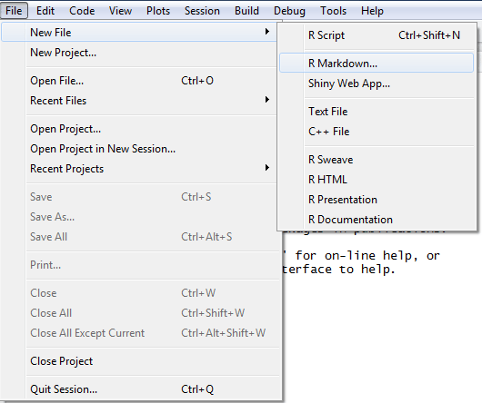
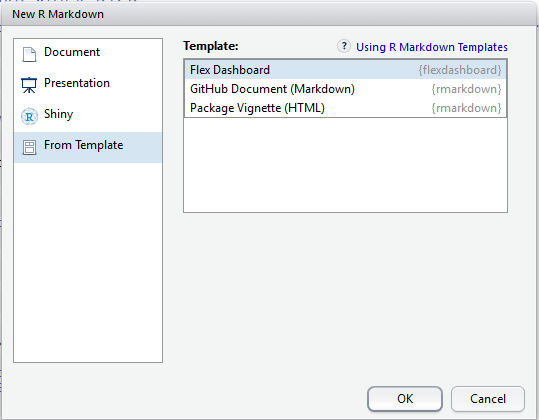

```{r setup, include=FALSE}
knitr::opts_chunk$set(echo = TRUE)
```

## Introducción
 
R Markdown es personalizable y extensible.
Existen varios paquetes de extensión que traen diferentes estilos, diseños y aplicaciones al ecosistema R Markdown. En este caso, vamos a ver paneles basados en el paquete flexdashboard (Iannone, Allaire y Borges 2018). Los paneles son particularmente comunes en los informes de estilo empresarial. Se pueden usar para resaltar resúmenes breves y clave de un informe. El diseño de un tablero a menudo se basa en la cuadrícula, con componentes dispuestos en cajas de varios tamaños.
Con el paquete flexdashboard, puede usar R Markdown para publicar un grupo de visualizaciones de datos relacionadas como un tablero.
Se puede  inscrustar una amplia variedad de componentes, incluidos widgets HTML, gráficos R, datos tabulares, indicadores, cuadros de valores y anotaciones de texto. Especifique diseños basados en filas o columnas (los componentes se redimensionan de manera inteligente para llenar el navegador y se adaptan para su visualización en dispositivos móviles).
 
## Primeros Pasos.

Puede crear un tablero desde RStudio usando Archivo Nuevo->R Markdown y en Template elegir FleshDasboard.





Si no está utilizando RStudio, puede crear un nuevo archivo Flexdashboard R Markdown desde la consola R


"```{r}
rmarkdown::draft(
  "dashboard2.Rmd", template = "flex_dashboard",
  package = "flexdashboard"
)
```"

## Primer Tablero

Ahora vemos como seria un primer tablero


En estos fragmentos de código, puede escribir código R arbitrario que genere diagramas R, widgets HTML y otros componentes.


## Paginas Multiples

Cuando hay varias secciones de primer nivel, se mostrarán como páginas separadas en el tablero.
Tenga en cuenta que una linea de signos igual(=) es la sintaxis alternativa de Markdown para los encabezados de sección de primer nivel (también puede usar un signo de numeral único #).


y el resultado quedaria asi:


## Componentes

Se puede incluir una amplia variedad de componentes en un diseño de tablero, que incluye:

1. Visualizaciones interactivas de datos JavaScript basadas en widgets HTML.

2. Salida gráfica R que incluye gráficos de base, celosía y cuadrícula.
3. Datos tabulares (con clasificación, filtrado y paginación opcionales).
4. Cuadros de valores para resaltar datos de resumen importantes.
5. Indicadores para mostrar valores en un medidor dentro de un rango especificado. Anotaciones de texto de varios tipos


